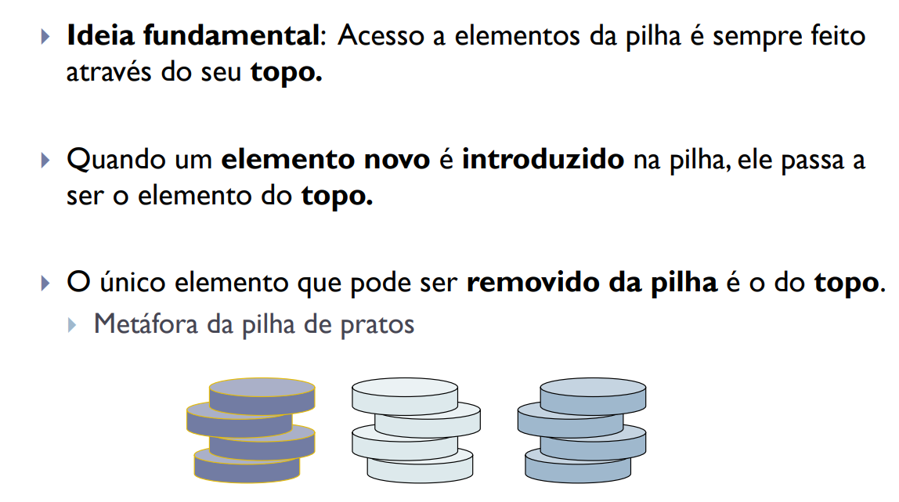

# Pilha Encadeada em Java

Este projeto implementa uma Pilha Encadeada em Java, com as seguintes operações:

- Criar uma pilha vazia;
- Testar se a pilha está vazia;
- Obter o tamanho da pilha;
- Consultar o elemento do topo da pilha (top);
- Inserir um novo elemento no topo da pilha (push);
- Remover o elemento do topo da pilha (pop)

## Como Usar

Para testar as operações da lista, você pode usar a classe `Main` fornecida neste projeto.

## Funcionalidades Adicionais
Sinta-se à vontade para expandir este projeto adicionando mais recursos e otimizações, como tratamento de erros e métodos adicionais, para melhorar a flexibilidade e eficiência da lista.